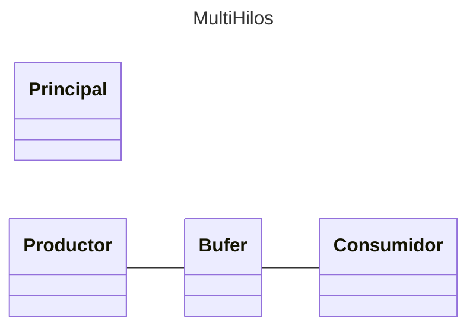

# Proyecto: Unidad III - Programación Concurrente (MultiHilos)

Ejemplos de Programación Concurrente (Multihilos). Basado en el libro Java Como Programar 7 Ed. Deitel & Deitel (Cap. 23)

## Diagrama de clases
[Editor en línea](https://mermaid.live/)

[Referencia-Mermaid](https://mermaid.js.org/syntax/classDiagram.html)


## Comandos Git-Cambios y Actualizaciones

### Por cada cambio importante que haga, actualice su historia usando los comandos:
```
git add .
git commit -m "Descripción del cambio"
git push origin main
```
